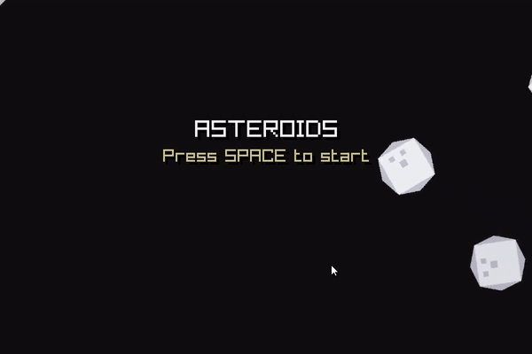
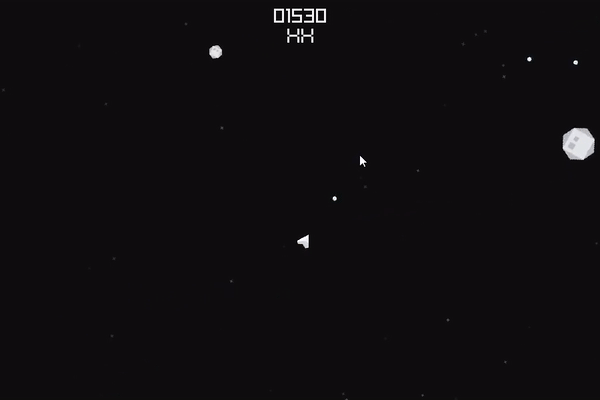
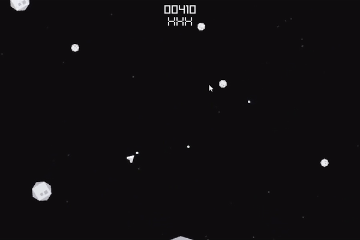

# entt_asteroids

An ecs asteroids prototype implemented using [EnTT](https://github.com/skypjack/entt) and [Raylib](https://github.com/raysan5/raylib).

This is a learning exercise to learn how to use EnTT and Raylib.

Still a work in progress, a lot of optimization needed.

## Screenshots

## Building
- Pull the submodules: `git submodule update --init --recursive`
- Build Raylib using `raylib.ps1` or `raylib.sh` (depending on your platform).
- Run premake: `premake5 gmake2`
- Build: `make`

### Notes
- This project uses [premake5](https://premake.github.io/) to generate the build files.
- You can use this premake5 fork [here](https://github.com/DanielEliasib/premake-core) to generate compile commands file.
- This project uses [Raylib](https://github.com/raysan5/raylib) for rendering (is already added as a submodule).
- This project uses [EnTT](https://github.com/skypjack/entt) (is already in the repo).

